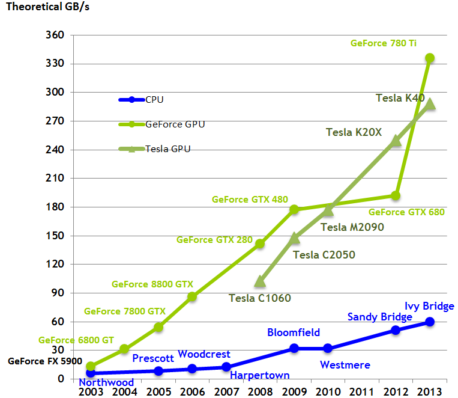

# Introduction
All of the notes in this document is in reference to the [CUDA Toolkit Documentation](http://docs.nvidia.com/cuda/index.html#axzz35rZYUBBR)

Verify that you have a CUDA capable GPU by running `lspci | grep -i nvidia`. If it doesn't show up then run the command `update-pciids` (located in `/sbin`) and then rerun the `lspci` command. 

Refer to ROCKS CUDA installation script as a reference. 

## Programming Guide
### CH 1: Introduction

Since GPUs were originally designed then they were optimized for realtime high-definition 2D/3D graphics. They have evolved into _highly parallel, multithreaded, manycore processors_ that have tremendous computational horsepower and very hight memory bandwidth. Figures 1-3 compares the GPUs to CPUs.

Given the figures show previously it makes more sense as to why GPUs are well-suited to address programs that cna be expressed as data-parallel computations. The GPU is essentially a hardware based SIMD processor. 

#### Scalable Programming Model
Today hardware parallelism is the de facto standard for most devices that do not constitute as embedded hardware (it will probably change soon as the manufacturing process decreases). The CUDA parallel programming model was designed with these facts in mind such that to minimize the learning curve associated with GPU programming. 

To handle these demands, NVIDIA GPUs contains a set of SMs (Streaming Multiprocessors) each processor is designed to execute a set of blocks as shown in Figure 4. TODO: Go into depth later about how blocks work.
 

### CH 2: Programming Model
#### Kernels
Kernels are the unit currency that programmers can utilized in order to perform computations on the GPU. They are specialized functions that are executed on the GPU. These functions can be executed N times in parallel by N different CUDA threads. Hence we get the SIMD architecture. 

#### Thread Hierarchy 
Since each kernel runs on its own thread then CUDA provides the necessary components to identify the thread. The index of a thread is determined by the following equation. 

$$ T_{i} = x + y * D_x + z * D_x * D_y $$

So why do we have blocks? GPU resources although they are impressive are still finite. A Streaming Multiprocessor can only process a maximum number of threads at a time. Hence blocks are used a method to group threads into effective "batch jobs". Current GPUs only support up to 1024 threads per thread block. Besides limits on resources blocks can execute in any order and are independent of each other. 

To further increase the programmers ability to manage threads, blocks can be grouped into grids which can contain at least one thread block (a single block is also a grid that is (1, 1, 1)). Figure 5 demonstrates the thread hierarchy.

#### Memory Hierarchy
Besides using grids, blocks, and threads to provide an execution hierarchy. These components also define a memory hierarchy. Threads, when executing have a _per-thread_ local memory (SM registers). Blocks have a reserved _per-block_ shared memory that all threads can access. While grids (and their children) have access to the GPU's _global_ memory. 

#### Heterogeneous Programming
The typical structure of a C program is usually a set of sequential operations. A CUDA enhanced C program consists of kernel functions that are executed where there will be a parallel benefit.

#### Compute Capability
The _compute capability_ of a device is defined by a major revision number and minor revision number. The major version number determines the architecture while the minor number represents an incremental improvement. Refer to [Compute Capabilities](http://docs.nvidia.com/cuda/cuda-c-programming-guide/index.html#compute-capabilities) for more info on specific devices. 

### CH 3: Programming Interface 
CUDA C the tools so that those familiar with C can take advantage of the GPU. This is achieved by adding a minimal set of extensions to the C language and runtime library. If the source file contains any of these extensions then it must be compiled with the `nvcc` compiler. 

The CUDA runtime is part of that interface that allows the programmer to allocate/deallocate device memory, transfer data between host memory and device memory, manage systems with multiple devices, and so forth... (refer to the __CUDA Reference Manual__)

#### Compilation with NVCC
If needed, kernels can be written in the CUDA instruction set architecture, called _PTX_. It is a lower level language therefore it is safe to continue using C without much of a performance loss. `nvcc` is a compiler driver that compiles C or PTX code.

##### Compilation Workflow
There are two types of compilation, first `nvcc` can perform offline compilation which takes the device code, separates from the host code and compiles into into PTX code or binary form (_cubin_ object). This allows application to either link to the compiled host code or ignore it and use the CUDA driver API to load and execute the PTX code or _cubin_ object. 

The next type is JIT compilation. Any PTX code loaded by an application at runtime is compiled further to binary code by the device. This _just-in-time compilation_ allows the code to be executed on other devices and takes advantages of compiler improvements in the future. The JITed code is then stored in a cache called a _compute cache_ which is automatically invalidated. 

Besides updated drivers, [CUDA Environment Variables](http://docs.nvidia.com/cuda/cuda-c-programming-guide/index.html#env-vars) can be used to control the JIT compilation process. 

##### Binary Compatibility 
Binary code is architecture-specific. A _cubin_ object is generated using the compiler option `-code` that specifies the targeted architecture. For example `-code=sm_13` produces binary code for devices of compute capability 1.3. That means the code will execute on any device that has a higher compute capability.

##### PTX Compatibility
Not all of the PTX instructions are supported on the compute architectures. Which means the targeted device compute capability must be specified by using the `-arch=sm_13` command. In this case `sm_13` tells `nvcc` to assume that the program is being compiled for compute capability 1.3 and above. If the programmer uses a feature that isn't supported then there will be an error.

##### Application 
Suppose that the set of devices to execute on is highly heterogeneous. To deal with this the nvcc compiler allows kernels to be compiled such that they support multiple compute architectures. 

    nvcc x.cu
          -gencode arch=compute_10,code=sm_10
          -gencode arch=compute_11,code=\'compute_11,sm_11\'

##### Cuda C runtime Runtime
The runtime is implemented in the `cudart` library. It can either be statically, or dynamically linked via `cudart.lib` or `libcudart.a`, dynamically linked via `cudart.dll` or `libcudart.so`. _All_ of its entry points are prefixed with `cuda`. 

  - [Initialization](http://docs.nvidia.com/cuda/cuda-c-programming-guide/index.html#initialization)
  - [Device Memory](http://docs.nvidia.com/cuda/cuda-c-programming-guide/index.html#device-memory)
  - [Shared Memory](http://docs.nvidia.com/cuda/cuda-c-programming-guide/index.html#shared-memory)
  - [Page-Locked Host Memory](http://docs.nvidia.com/cuda/cuda-c-programming-guide/index.html#page-locked-host-memory) __This is an interesting page take a good look at it, takes a shot at shared memory__

### CH 4: [Hardware Implementation](http://docs.nvidia.com/cuda/cuda-c-programming-guide/index.html#hardware-implementation)

__ This is an important chapter__ it covers the CUDA architecture. Even though this is NVIDIA specific. The concepts provided will be similar for any GPU. 

The NVIDIA GPU architecture consists of an array of special processors called Streaming Multiprocessors (SMs). When kernels are executed the blocks in the grid are _enumerated_ and _distributed_ to the SMs with the available execution capacity. These SMs allow threads and blocks to execute concurrently. 

#### SIMT Architecture
SIMT (Single-Instruction, Multiple-Thread) is the architecture that is leveraged it is similar to SIMD (Single-Instruction, Multiple-Data) but there are differences. These differences come into play depending on how much optimization is desired. 

Each SM is capable of executing 32 threads concurrently, which is referred to as a _warp_. _Warps_ are handled by a special component of the SM called the _warp-scheduler_ The SM _warps_ through the thread in increasing order of their IDs (refer to Thread Hierarchy section on details for calculating the ID). Besides warps there are _half-warps_ and _quarter-warps_ with represent concurrent groups of 16 and 8 threads respectively. 

In an ideal situation, all threads should execute concurrently in a warp. In reality though, threads execution paths my may diverge in groups during a warp warp. Each group of divergence can execute concurrently. In the worst case scenario where each group is at most one thread then the SM must execute each thread serially. 

The CUDA Toolkit documentation states that it is safe to assume that SIMT and SIMD are equivalent unless the programmer seeks optimization of the code. 

#### Hardware Multithreading
The execution context (program counters, registers,...) for each warp processed by the SM is maintained on chip during the warp lifetime. Therefore switching from one execution context to another execution context has not cost (switching between threads in a warp). The documentation states that each multiprocessor has 32-bit registers and parallel data cache (shared memory) that is shared amongst the blocks. 

The number of warps required to execute a block of threads can be determined by the following formula:

$$ ceil\left(\frac{T}{w_{size}}, 1\right) $$

### [Performance Guidelines](http://docs.nvidia.com/cuda/cuda-c-programming-guide/index.html#performance-guidelines)
There are three main performance rules to follow: 

  1. Maximize parallel execution to achieve maximum utilization.
  2. Optimize memory usage to achieve maximum memory throughput.
  3. Optimize instruction usage to achieve maximum instruction throughput. 

#### Maximize Utilization
Structure the application such that GPU utilization is maximized. Write code such that the GPU's parallelism is exploited as much as possible in order to keep the GPU busy. That is schedule tasks to the hardware that they are most appropriate for. 

#### Maximize Memory Throughput
Maximize memory through put by minimizing data transfers through areas of low bandwidth. This is done by:

  1. Minimizing data transfers between host and device. 
  2. Minimizing data transfers from device global memory.
  3. Minimizing data transfers between the shared memory and caches. 
    1. L1 cache available for compute capability 2.0 and 3.0. 
    2. L2 available on compute capability 2.0 and above. 
    3. Texture cache and constant cache available on all devices. 

Proper organization of memory accesses can increase the performance dramatically.

READ FURTHER:
  - [Data Transfer between Host and Device](http://docs.nvidia.com/cuda/cuda-c-programming-guide/index.html#data-transfer-between-host-and-device)
  - [Device Memory Accesses](http://docs.nvidia.com/cuda/cuda-c-programming-guide/index.html#device-memory-accesses)

## Definitions
ALU (Arithmetic Logic Unit)
:  The minimum required component to have a CPU. Performs integer arithmetic and logical operations.

Control
:  Controls other components on the chip.

Cache
:  Localized memory that is faster than global memory. 

Block
:  Threads are grouped into blocks.

SM ( Streaming Multiprocessor )
:  A processor designed to handle blocks of threads. Usually can go through 32 threads at a time which is referred to as a _warp_

Warp
:  The minimum number of threads an SM can execute concurrently.

Warp-Scheduler
:  Constructs warps of threads to be handed to the SM. 

SIMD
:  Single-Instruction, Multiple-Data. SIMD programs are aware of the SIMD width. 

Active Threads
:  Threads that are in the warps current execution path. 

Inactive Threads
:  Threads that are not in the current execution path. 

SIMT
:  Single-Instruction, Multiple-Threads. SIMT programs are not aware of the SIMT width. 

PTX (Parallel Thread Execution)
:  An instruction set for the parallel thread execution virtual machine. "PTX exposes the GPU as a data-parallel computing device"

JIT
:  Just-in-time

Compute Capability
:  What features a NVIDIA GPU can support. Refer to the [Compute Capabilities](http://docs.nvidia.com/cuda/cuda-c-programming-guide/index.html#compute-capabilities) table in the toolkit documentation. 

